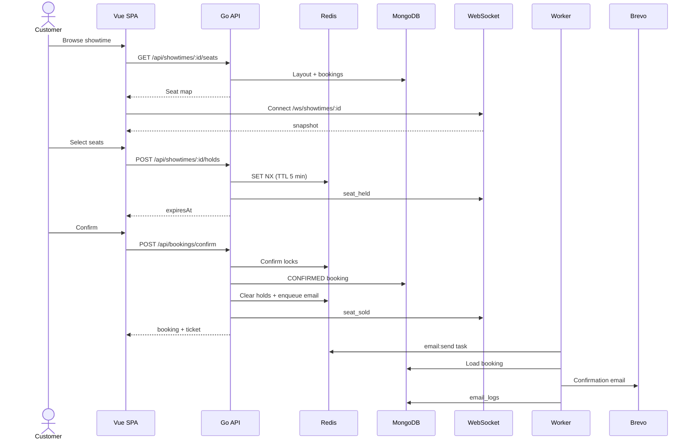

# Cinema Ticket Booking System

A full-stack cinema ticket booking platform with real-time seat maps, Redis-backed holds, and digital tickets. Customer SPA in Vue 3; API in Go (Gin); MongoDB for durable data; Redis for holds, locks, and background jobs.

**Related docs**

- Architecture diagram: [`docs/System_architecture.png`](docs/System_architecture.png)
- Thai version: [`docs/th/system-overview.md`](docs/th/system-overview.md)

---

## 1. System Architecture Diagram


### Component responsibilities

| Component | Role |
| --- | --- |
| **Vue SPA** (`app/`) | Customer browse/book flow, seat map, checkout, My Bookings, admin dashboard |
| **nginx** | Single origin; serves static assets and reverse-proxies API and WebSocket |
| **Go API** (`api/cmd/server`) | REST endpoints, auth, holds, confirm, catalog, admin APIs |
| **WebSocket Hub** (`api/internal/ws`) | Per-showtime seat map events; Redis pub/sub for multi-instance fan-out |
| **Worker** (`api/cmd/worker`) | Background jobs via asynq (confirmation email) |
| **MongoDB** | Users, movies, cinemas, screens, showtimes, bookings, audit/email logs |
| **Redis** | Seat holds, confirm locks, idempotency cache, asynq queue, WS pub/sub |
| **Brevo** | Transactional email provider for booking confirmations |

---

## 2. Tech Stack Overview

| Layer | Technology | Purpose |
| --- | --- | --- |
| **Frontend** | Vue 3 + Vite + TypeScript | Customer SPA and admin UI |
| **UI** | Tailwind CSS v4 | Layout, seat map, responsive design |
| **State / routing** | Pinia + Vue Router | Auth session, booking flow, route guards |
| **i18n** | vue-i18n | English / Thai UI and localized confirmation emails |
| **Backend** | Go + Gin | REST API, WebSocket hub, business logic |
| **Config** | Viper | `config.yaml` + environment variables |
| **Database** | MongoDB 7 | Persistent domain data |
| **Cache / coordination** | Redis 7 | Holds, locks, job queue, pub/sub |
| **Background jobs** | hibiken/asynq | Async email with retries (Redis-backed) |
| **Real-time** | WebSocket + Redis pub/sub | Live seat map updates per showtime |
| **Auth** | JWT (httpOnly cookie) + Google OAuth 2.0 | Customer and Admin roles |
| **Email** | Brevo API | Booking confirmation (HTML + plain text) |
| **QR codes** | go-qrcode | Digital ticket generation |
| **Reverse proxy** | nginx | Production single-origin routing |
| **Containers** | Docker Compose | Local and deployment stack |
| **CI** | GitHub Actions | `go test`, Vue lint/type-check/build |

### Repository layout

```
TicketBookingSystem/
├── app/                 # Vue 3 SPA
├── api/
│   ├── cmd/server/      # API entrypoint
│   ├── cmd/worker/      # asynq worker
│   └── internal/        # auth, booking, hold, ws, email, tasks, …
├── nginx/               # Reverse proxy config
├── docker-compose.yml
└── docs/                # Thai docs + architecture diagram
```

---

## 3. Booking Flow (Step by Step)

### Sequence diagram



### Customer happy path

| Step | Actor | Action | System response |
| --- | --- | --- | --- |
| 1 | Customer | Browse cinemas, movies, and showtimes | `GET /api/movies`, `GET /api/showtimes` from MongoDB |
| 2 | Customer | Open seat map for a showtime (no login required) | `GET /api/showtimes/:id/seats` — derives `AVAILABLE`, `SOLD`, `BLOCKED`, `HELD` |
| 3 | Customer | Connect WebSocket | `WS /ws/showtimes/:id` — receives `snapshot`, then live `seat_held` / `seat_released` / `seat_sold` |
| 4 | Customer | Sign in (if not already) | Email/password or Google OAuth → JWT httpOnly cookie |
| 5 | Customer | Select seats | `POST /api/showtimes/:id/holds` — Redis `SET NX` per seat, 5-min TTL |
| 6 | UI | Show countdown | Server returns `expiresAt`; TTL refreshes when **adding** more seats |
| 7 | Customer | Review checkout | Order summary from held seats + price tiers |
| 8 | Customer | Confirm booking | `POST /api/bookings/confirm` with `Idempotency-Key` header |
| 9 | API | Acquire confirm locks | Redis `lock:confirm:{showtimeId}:{seatId}` per seat (sorted order) |
| 10 | API | Validate + persist | Insert `CONFIRMED` booking in MongoDB; clear Redis holds |
| 11 | API | Broadcast + enqueue | WebSocket `seat_sold`; enqueue `email:send` task to asynq |
| 12 | Worker | Send email | Load booking, render EN/TH template, call Brevo, write `email_logs` |
| 13 | Customer | View ticket | My Bookings or public link `/ticket/:ref?t=` with QR code |

### Seat status rules

```
AVAILABLE = layout seats − SOLD − BLOCKED − (other users' Redis holds)
```

- **SOLD** — seat appears in a confirmed `bookings` document for that showtime.
- **BLOCKED** — seat `type: blocked` in screen layout (all showtimes on that screen).
- **HELD** — active Redis key `hold:{showtimeId}:{seatId}` owned by a user.

### Hold lifecycle

| Event | Behavior |
| --- | --- |
| Add seat | `SET NX` hold key; refresh 5-min TTL on **all** user's holds for that showtime |
| Remove seat | Immediate `DEL`; remaining holds keep current TTL |
| TTL expiry | Redis key expires → keyspace listener → audit `booking_timeout` + WS `seat_released` |
| Navigate away | Holds remain until TTL (no release on WebSocket disconnect) |
| Abandon | `DELETE /api/showtimes/:id/holds` releases immediately |
| Confirm | Holds cleared; seats become SOLD |

### Confirm idempotency

- Client sends `Idempotency-Key` (UUID) on every confirm attempt.
- Successful result cached in Redis (`idempotency:confirm:{key}`, 24h TTL).
- **Retry after success** → `200` with same booking (no duplicate).
- **Retry after failure with expired holds** → `409`; client must re-select seats and use a new key.

---

## 4. Redis Lock Strategy

Redis serves two distinct locking patterns in this system.

### A. Seat holds (reservation during checkout)

**Purpose:** Prevent two users from selecting the same seat while one is checking out.

| Key pattern | Value | TTL |
| --- | --- | --- |
| `hold:{showtimeId}:{seatId}` | `{ userId, heldAt }` JSON | 5 minutes |
| `user_holds:{userId}:{showtimeId}` | SET of `seatId` | 5 minutes |

**Mechanism:** `SET NX` (set if not exists). If the key already exists and belongs to another user → reject with conflict.

**Rules:**

- Max **10 seats** per user per showtime.
- Cannot hold `SOLD` or `BLOCKED` seats.
- TTL refreshes on **add only**, not on remove.
- User may hold seats on **multiple showtimes** simultaneously.

### B. Confirm locks (double-booking prevention)

**Purpose:** Serialize concurrent confirm requests for the same seat.

| Key pattern | Value | TTL |
| --- | --- | --- |
| `lock:confirm:{showtimeId}:{seatId}` | `"1"` | 10 seconds |

**Mechanism:**

1. Sort `seatId` values alphabetically (deadlock avoidance).
2. Acquire each lock with `SET NX` in order.
3. Re-validate holds and sold status under lock.
4. Insert booking in MongoDB.
5. Release all locks in `defer`.

If any `SET NX` fails → `409 Seat conflict`; previously acquired locks are released.

### C. Other Redis usage

| Key pattern | Purpose | TTL |
| --- | --- | --- |
| `idempotency:confirm:{key}` | Cached confirm response | 24 hours |
| `ws:showtime:{showtimeId}` | Pub/sub channel for WebSocket fan-out | — |
| asynq internal keys | Job queue for `email:send` | Managed by asynq |

### Redis configuration

Docker Compose starts Redis with `--notify-keyspace-events Ex` so the API can listen for hold key expiry (`__keyevent@*__:expired`).

---

## 5. Message Queue (asynq)

The system uses **[hibiken/asynq](https://github.com/hibiken/asynq)** — a Go library that stores jobs in Redis (not a separate broker like RabbitMQ or Kafka).

### Why a queue?

Booking confirm must be **fast and reliable**. Email delivery is slow and can fail (network, provider rate limits). Decoupling email from the HTTP response means:

- Customer gets immediate confirm response.
- Failed emails retry without rolling back the booking.
- API stays responsive under load.

### Flow

```
POST /api/bookings/confirm
        │
        ▼
  Booking saved (MongoDB)
        │
        ▼
  tasks.NewEmailSendTask(bookingId)
        │
        ▼
  asynq.Client.Enqueue()  ──►  Redis queue
                                    │
                                    ▼
                            Worker (cmd/worker)
                                    │
                    ┌───────────────┼───────────────┐
                    ▼               ▼               ▼
              Load booking    Render template   Brevo API
              + catalog       (EN or TH)        send email
                    │                               │
                    └──────────► email_logs ◄───────┘
```

### Task types (MVP)

| Task type | Payload | Handler | Trigger |
| --- | --- | --- | --- |
| `email:send` | `{ "bookingId": "..." }` | `email.Service.HandleEmailSend` | After successful confirm; admin resend |

### Retry behavior

- asynq provides built-in retry with exponential backoff on handler failure.
- Email failure does **not** undo the confirmed booking.
- Status recorded in `email_logs` for admin visibility.
- Admin can re-queue via `POST /api/admin/bookings/:id/resend-email`.

### WebSocket pub/sub (related, not asynq)

Real-time seat events use Redis **pub/sub** directly (`ws:showtime:{id}`), not the asynq queue. This is separate from background jobs but also runs through Redis.

---

## 6. How to Run

### Prerequisites

- Docker and Docker Compose
- (Optional) Node.js 20+ and Go 1.22+ for native dev without full Docker rebuild

### Quick start (Docker — recommended)

```bash
# 1. Copy environment file
cp .env.example .env

# 2. Edit .env — at minimum set ADMIN_EMAIL and ADMIN_SEED_PASSWORD
#    For email: set BREVO_API_KEY and EMAIL_FROM
#    For Google OAuth: set GOOGLE_CLIENT_ID and GOOGLE_CLIENT_SECRET

# 3. Start the full stack
docker compose up --build
```

| URL | Service |
| --- | --- |
| http://localhost | Customer + admin SPA (via nginx) |
| http://localhost/api/health | API health check |
| http://localhost:8080/api/health | API direct (bypass nginx) |
| localhost:27017 | MongoDB (Compass / GUI tools) |

**Default admin login:** use `ADMIN_EMAIL` + `ADMIN_SEED_PASSWORD` from `.env` at `/login`, then open `/admin`.

### Seed sample data

With MongoDB running (via Docker or locally):

```bash
cd api
go run ./cmd/seed

# Replace existing catalog with Bangkok sample data (7 cinemas, 14 movies, 30 days of showtimes)
go run ./cmd/seed -reset-catalog
```

### Local development (hot reload)

**Frontend only** (proxies API if configured in Vite):

```bash
cd app
npm install
npm run dev
```

**API + worker** (requires local MongoDB and Redis, or Docker for just those services):

```bash
cd api
export MONGO_URI=mongodb://localhost:27017/tbs
export REDIS_URL=redis://localhost:6379/0
export JWT_SECRET=dev-secret
export APP_URL=http://localhost:5173

go run ./cmd/server    # terminal 1
go run ./cmd/worker    # terminal 2
```

### Run tests

```bash
# API
cd api && go test ./...

# Frontend
cd app && npm run lint && npm run type-check && npm run test:unit && npm run build
```

### Production checklist (HITL)

- [ ] Google OAuth sign-in tested with real credentials
- [ ] `BREVO_API_KEY` and `EMAIL_FROM` configured
- [ ] Two-browser WebSocket seat-map smoke test
- [ ] Incognito public ticket link from confirmation email

---

## 7. Assumptions and Trade-offs

### Assumptions

| Area | Assumption |
| --- | --- |
| **Concurrency** | Moderate concurrent users per showtime; Redis + sorted confirm locks are sufficient |
| **Inventory** | Sold seats derived from confirmed `bookings` queries (no `soldSeatIds[]` on showtime) |
| **Cancellation** | No booking cancellation in MVP — sold seats never return to available |
| **Payment** | Confirm-only; `total` is informational, no payment gateway |
| **Auth** | Single httpOnly JWT cookie (7-day expiry); no refresh tokens |
| **Admin scope** | Global admin — all cinemas, no per-venue RBAC |
| **Seat map** | WebSocket updates are advisory; HTTP hold/confirm is authoritative |
| **Holds** | 5-minute TTL; user can hold on multiple showtimes at once |
| **Email** | Brevo is the sole provider; EN/TH templates at confirm time locale |
| **Deployment** | Single-region Docker Compose; nginx as entry point |

### Trade-offs

| Decision | Benefit | Cost |
| --- | --- | --- |
| **Redis holds (not MongoDB)** | Fast, automatic TTL expiry, low write load | Holds lost if Redis fails; not durable across Redis flush |
| **Derive SOLD from bookings** | Simple schema; no sync bugs on showtime doc | Seat map query aggregates bookings (acceptable at MVP scale) |
| **asynq on Redis (not Kafka/RabbitMQ)** | One less infrastructure component | Redis handles holds + queue + pub/sub — shared failure domain |
| **No payment in MVP** | Faster delivery; simpler confirm flow | No revenue collection; total is display-only |
| **httpOnly cookie auth** | XSS-resistant session | Requires same-origin (nginx) or CORS care in dev |
| **WebSocket advisory** | Responsive UI; optimistic feel | Client must reconcile on HTTP errors |
| **No cancel/refund** | Append-only inventory; simpler logic | Support cannot void bookings in MVP |
| **Hold survives disconnect** | Simpler server; TTL is single source of truth | Seats may appear held until TTL if user abandons without DELETE |
| **Monolith API + worker** | Shared code; easy deploy | Worker scales separately from API but same codebase |
| **Brevo async email** | Confirm is not blocked by email latency | User may see booking before email arrives |

### Invariants (must always hold)

1. A seat cannot be **CONFIRMED** twice for the same showtime.
2. Holds exist only in Redis — MongoDB never stores `HELD` as durable booking state.
3. Email failure does not roll back a confirmed booking.
4. Only authenticated users with active holds can confirm.

---

*Last updated: 2026-06-12. For implementation status see [`context/progress-tracker.md`](context/progress-tracker.md).*
