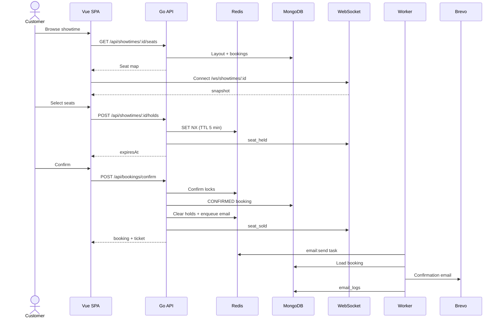

# Cinema Ticket Booking System

Full-stack cinema booking with **live seat maps**, **5-minute Redis holds**, digital tickets (QR), and an admin console. Vue 3 SPA + Go (Gin) API + MongoDB + Redis.

| | |
| --- | --- |
| **Stack** | Vue 3 · Go · MongoDB · Redis · WebSocket · Docker |
| **Docs** | [Architecture diagram](docs/System_architecture.png) · [ภาษาไทย](docs/th/system-overview.md) |
| **Status** | [Implementation tracker](context/progress-tracker.md) |

**Quick start**

```bash
cp .env.example .env   # set ADMIN_EMAIL, ADMIN_SEED_PASSWORD at minimum
docker compose up --build
```

Open **http://localhost** · Admin at `/login` → `/admin`

---

## Contents

- [Quick start](#quick-start)
- [Architecture](#architecture)
- [Tech stack](#tech-stack)
- [Booking flow](#booking-flow)
- [Redis locks](#redis-locks)
- [Background jobs](#background-jobs)
- [Development](#development)
- [Assumptions & trade-offs](#assumptions--trade-offs)

---

## Quick start

### Prerequisites

- Docker and Docker Compose
- Optional: Node.js 20+ and Go 1.22+ for native dev

### Docker (recommended)

```bash
cp .env.example .env
# Edit .env — ADMIN_EMAIL, ADMIN_SEED_PASSWORD (required)
# Optional: BREVO_API_KEY, EMAIL_FROM, GOOGLE_CLIENT_ID, GOOGLE_CLIENT_SECRET

docker compose up --build
```

| URL | What |
| --- | --- |
| http://localhost | Customer + admin SPA |
| http://localhost/api/health | API health (via nginx) |
| http://localhost:8080/api/health | API direct |
| localhost:27017 | MongoDB |

### Seed sample data

```bash
cd api
go run ./cmd/seed
go run ./cmd/seed -reset-catalog   # Bangkok sample: 7 cinemas, 14 movies, 30 days
```

---

## Architecture


| Component | Role |
| --- | --- |
| **Vue SPA** (`app/`) | Browse, seat map, checkout, My Bookings, admin UI |
| **nginx** | Single origin — static files, `/api/*`, `/ws/*` |
| **Go API** (`api/cmd/server`) | REST, auth, holds, confirm, catalog, admin |
| **WebSocket hub** (`api/internal/ws`) | Live seat events; Redis pub/sub for fan-out |
| **Worker** (`api/cmd/worker`) | Background email jobs (asynq) |
| **MongoDB** | Users, catalog, bookings, audit & email logs |
| **Redis** | Holds, confirm locks, idempotency, job queue, pub/sub |
| **Brevo** | Transactional confirmation email |

---

## Tech stack

| Layer | Technology |
| --- | --- |
| Frontend | Vue 3, Vite, TypeScript, Tailwind CSS v4, Pinia, Vue Router |
| i18n | vue-i18n (EN / TH UI and emails) |
| Backend | Go, Gin, Viper |
| Data | MongoDB 7 (durable), Redis 7 (ephemeral + queue) |
| Real-time | WebSocket + Redis pub/sub |
| Jobs | [hibiken/asynq](https://github.com/hibiken/asynq) on Redis |
| Auth | JWT httpOnly cookie + Google OAuth |
| Email / tickets | Brevo API, go-qrcode |
| Deploy / CI | Docker Compose, nginx, GitHub Actions |

```
TicketBookingSystem/
├── app/              # Vue 3 SPA
├── api/
│   ├── cmd/server/   # API
│   ├── cmd/worker/   # asynq worker
│   └── internal/     # auth, booking, hold, ws, email, …
├── nginx/
├── docker-compose.yml
└── docs/
```

---

## Booking flow

Customers browse without signing in, connect a WebSocket for live updates, sign in to hold seats, then confirm. HTTP hold/confirm is authoritative; WebSocket updates are advisory.



### Customer journey

1. **Browse** — movies and showtimes (`GET /api/movies`, `/api/showtimes`)
2. **Open seat map** — no login required (`GET /api/showtimes/:id/seats`)
3. **Connect WebSocket** — `WS /ws/showtimes/:id` for `snapshot`, then `seat_held` / `seat_released` / `seat_sold`
4. **Sign in** — email/password or Google OAuth → httpOnly JWT cookie
5. **Select seats** — `POST /api/showtimes/:id/holds` (Redis `SET NX`, 5-min TTL)
6. **Checkout** — countdown from `expiresAt`; TTL refreshes when **adding** seats
7. **Confirm** — `POST /api/bookings/confirm` with `Idempotency-Key` header
8. **Ticket** — My Bookings or `/ticket/:ref?t=` with QR code

Behind confirm: acquire per-seat Redis locks → validate → write `CONFIRMED` booking → broadcast `seat_sold` → enqueue `email:send` → worker sends via Brevo.

### Seat states

`AVAILABLE` = layout seats − SOLD − BLOCKED − other users' Redis holds

| State | Meaning |
| --- | --- |
| **SOLD** | Seat in a confirmed booking for this showtime |
| **BLOCKED** | `type: blocked` in screen layout |
| **HELD** | Active Redis key `hold:{showtimeId}:{seatId}` |

<details>
<summary><strong>Hold lifecycle</strong></summary>

| Event | Behavior |
| --- | --- |
| Add seat | `SET NX`; refresh 5-min TTL on **all** user's holds for that showtime |
| Remove seat | Immediate `DEL`; remaining holds keep TTL |
| TTL expiry | Keyspace listener → audit `booking_timeout` + WS `seat_released` |
| Navigate away | Holds stay until TTL (disconnect does not release) |
| Abandon | `DELETE /api/showtimes/:id/holds` |
| Confirm | Holds cleared; seats become SOLD |

</details>

<details>
<summary><strong>Confirm idempotency</strong></summary>

- Client sends `Idempotency-Key` (UUID) on every confirm attempt.
- Success cached in Redis (`idempotency:confirm:{key}`, 24h).
- Retry after success → `200` with same booking.
- Retry after failure with expired holds → `409`; re-select seats and use a new key.

</details>

---

## Redis locks

Two locking patterns plus shared keys.

### Seat holds (checkout)

Prevent two users selecting the same seat during checkout.

| Key | Value | TTL |
| --- | --- | --- |
| `hold:{showtimeId}:{seatId}` | `{ userId, heldAt }` JSON | 5 min |
| `user_holds:{userId}:{showtimeId}` | SET of `seatId` | 5 min |

`SET NX` — reject if another user owns the key. Max **10 seats** per user per showtime. TTL refreshes on **add only**. Holds on multiple showtimes allowed.

### Confirm locks (double-booking)

| Key | Value | TTL |
| --- | --- | --- |
| `lock:confirm:{showtimeId}:{seatId}` | `"1"` | 10 sec |

Sort `seatId` alphabetically → `SET NX` each lock → re-validate → insert booking → release in `defer`. Any failure → `409 Seat conflict`.

### Other Redis keys

| Key | Purpose |
| --- | --- |
| `idempotency:confirm:{key}` | Cached confirm response (24h) |
| `ws:showtime:{showtimeId}` | WebSocket pub/sub channel |
| asynq keys | `email:send` job queue |

Redis runs with `--notify-keyspace-events Ex` in Docker Compose so the API hears hold expiry (`__keyevent@*__:expired`).

---

## Background jobs

Email is decoupled from confirm so the API responds immediately and retries on failure without rolling back bookings.

```
POST /api/bookings/confirm → MongoDB → enqueue email:send → Worker → Brevo → email_logs
```

| Task | Payload | Trigger |
| --- | --- | --- |
| `email:send` | `{ "bookingId": "..." }` | After confirm; admin resend |

- asynq retries with exponential backoff.
- Email failure does **not** undo the booking.
- Admin resend: `POST /api/admin/bookings/:id/resend-email`.

> WebSocket events use Redis pub/sub (`ws:showtime:{id}`), not the asynq queue.

---

## Development

### Frontend only

```bash
cd app && npm install && npm run dev
```

### API + worker (local)

```bash
cd api
export MONGO_URI=mongodb://localhost:27017/tbs
export REDIS_URL=redis://localhost:6379/0
export JWT_SECRET=dev-secret
export APP_URL=http://localhost:5173

go run ./cmd/server    # terminal 1
go run ./cmd/worker    # terminal 2
```

### Tests

```bash
cd api && go test ./...
cd app && npm run lint && npm run type-check && npm run test:unit && npm run build
```

### Production checklist

- [ ] Google OAuth with real credentials
- [ ] `BREVO_API_KEY` and `EMAIL_FROM` set
- [ ] Two-browser WebSocket seat-map smoke test
- [ ] Incognito public ticket link from confirmation email

---

## Assumptions & trade-offs

<details>
<summary><strong>Assumptions</strong></summary>

| Area | Assumption |
| --- | --- |
| Concurrency | Moderate load; Redis + sorted confirm locks suffice |
| Inventory | SOLD derived from `bookings` (no `soldSeatIds[]` on showtime) |
| Cancellation | None in MVP — sold seats stay sold |
| Payment | Confirm-only; `total` is display-only |
| Auth | httpOnly JWT (7 days); no refresh tokens |
| Admin | Global role; no per-venue RBAC |
| Seat map | WebSocket advisory; HTTP hold/confirm authoritative |
| Holds | 5-min TTL; multiple showtimes at once OK |
| Email | Brevo only; EN/TH at confirm locale |
| Deploy | Single-region Docker Compose behind nginx |

</details>

<details>
<summary><strong>Trade-offs</strong></summary>

| Decision | Benefit | Cost |
| --- | --- | --- |
| Redis holds | Fast TTL expiry, low write load | Not durable if Redis fails |
| SOLD from bookings | Simple schema | Seat map aggregates bookings |
| asynq on Redis | No extra broker | Shared failure domain with holds/pub/sub |
| No payment | Faster MVP | No revenue collection |
| httpOnly cookie | XSS-resistant | Same-origin / CORS care in dev |
| WebSocket advisory | Responsive UI | Client reconciles on HTTP errors |
| No cancel/refund | Append-only inventory | Support cannot void in MVP |
| Hold survives disconnect | TTL is source of truth | Abandoned holds until TTL |
| Monolith API + worker | Shared code, easy deploy | Separate scale paths |
| Async email | Fast confirm | Email may lag booking UI |

</details>

### Invariants

1. A seat cannot be **CONFIRMED** twice for the same showtime.
2. Holds live only in Redis — MongoDB never stores `HELD`.
3. Email failure does not roll back a confirmed booking.
4. Only authenticated users with active holds can confirm.

---

*Last updated: 2026-06-12*
