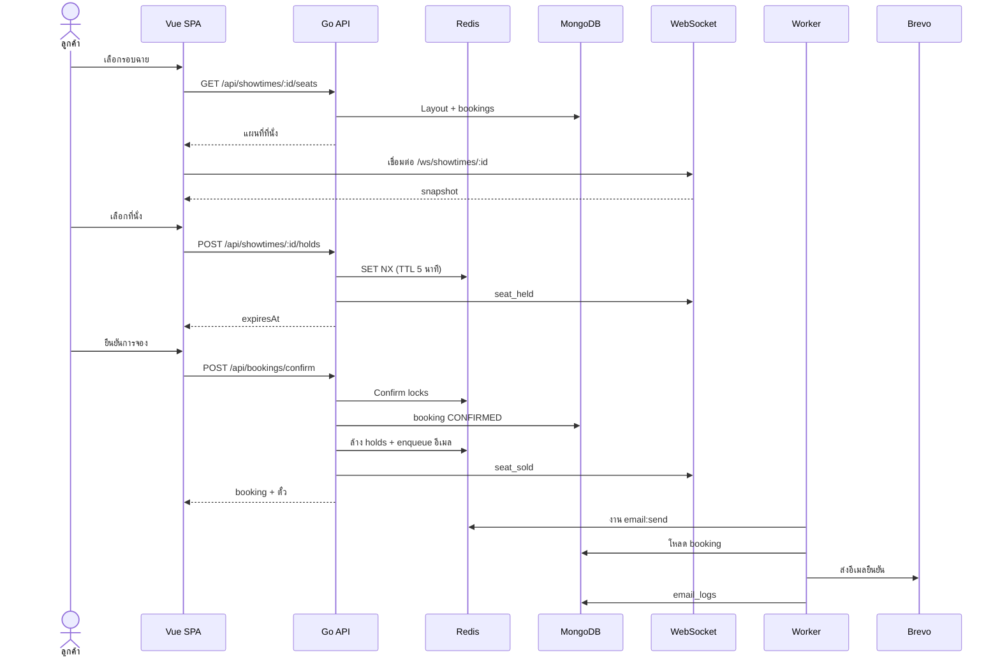

# ระบบจองตั๋วภาพยนตร์ — ภาพรวมทางเทคนิค (ภาษาไทย)


เอกสารนี้อธิบายสถาปัตยกรรม กระบวนการจอง และวิธีรันระบบในเครื่อง

**ไฟล์ที่เกี่ยวข้อง**

- วิดีโอสาธิต: [YouTube](https://youtu.be/bVDQ12Q24JM)
- แผนภาพสถาปัตยกรรม: [`../System_architecture.png`](../System_architecture.png)
- ฉบับภาษาอังกฤษ: [`../../README.md`](../../README.md)

---

## 1. แผนภาพสถาปัตยกรรมระบบ


### หน้าที่ของแต่ละส่วน

| ส่วนประกอบ | หน้าที่ |
| --- | --- |
| **Vue SPA** (`app/`) | เรียกดู/จองตั๋ว แผนที่ที่นั่ง เช็คเอาต์ My Bookings แดชบอร์ดแอดมิน |
| **nginx** | Single origin — เสิร์ฟ static และ reverse proxy ไป API / WebSocket |
| **Go API** (`api/cmd/server`) | REST, auth, hold, confirm, แคตตาล็อก, API แอดมิน |
| **WebSocket Hub** (`api/internal/ws`) | อีเวนต์แผนที่ที่นั่งต่อรอบฉาย; Redis pub/sub สำหรับหลาย instance |
| **Worker** (`api/cmd/worker`) | งานเบื้องหลังผ่าน asynq (อีเมลยืนยันการจอง) |
| **MongoDB** | ผู้ใช้ ภาพยนตร์ โรงภาพยนตร์ ฮอลล์ รอบฉาย การจอง audit/email logs |
| **Redis** | Seat hold, confirm lock, idempotency cache, คิว asynq, WS pub/sub |
| **Brevo** | ผู้ให้บริการอีเมลธุรกรรมสำหรับยืนยันการจอง |

---

## 2. ภาพรวม Tech Stack

| ชั้น | เทคโนโลยี | วัตถุประสงค์ |
| --- | --- | --- |
| **Frontend** | Vue 3 + Vite + TypeScript | SPA ลูกค้าและ UI แอดมิน |
| **UI** | Tailwind CSS v4 | เลย์เอาต์ แผนที่ที่นั่ง responsive |
| **State / routing** | Pinia + Vue Router | เซสชัน auth ฟลูว์จอง route guard |
| **i18n** | vue-i18n | UI ไทย/อังกฤษ และอีเมลยืนยันตามภาษา |
| **Backend** | Go + Gin | REST API, WebSocket hub, business logic |
| **Config** | Viper | `config.yaml` + ตัวแปรสภาพแวดล้อม |
| **Database** | MongoDB 7 | ข้อมูลโดเมนถาวร |
| **Cache / coordination** | Redis 7 | Hold, lock, คิวงาน, pub/sub |
| **Background jobs** | hibiken/asynq | อีเมลแบบ async พร้อม retry (Redis-backed) |
| **Real-time** | WebSocket + Redis pub/sub | อัปเดตแผนที่ที่นั่งแบบเรียลไทม์ต่อรอบฉาย |
| **Auth** | JWT (httpOnly cookie) + Google OAuth 2.0 | บทบาท Customer และ Admin |
| **Email** | Brevo API | อีเมลยืนยันการจอง (HTML + plain text) |
| **QR codes** | go-qrcode | สร้างตั๋วดิจิทัล |
| **Reverse proxy** | nginx | routing แบบ single origin ใน production |
| **Containers** | Docker Compose | สแต็ก local และ deploy |
| **CI** | GitHub Actions | `go test`, Vue lint/type-check/build |

### โครงสร้าง repository

```
TicketBookingSystem/
├── app/                 # Vue 3 SPA
├── api/
│   ├── cmd/server/      # จุดเริ่ม API
│   ├── cmd/worker/      # asynq worker
│   └── internal/        # auth, booking, hold, ws, email, tasks, …
├── nginx/               # การตั้งค่า reverse proxy
├── docker-compose.yml
└── docs/                # เอกสารไทย + แผนภาพสถาปัตยกรรม
```

---

## 3. ขั้นตอนการจอง (Booking Flow)

### แผนภาพลำดับ (Sequence diagram)



### เส้นทางปกติของลูกค้า

| ขั้น | ผู้เกี่ยวข้อง | การกระทำ | การตอบสนองของระบบ |
| --- | --- | --- | --- |
| 1 | ลูกค้า | เลือกโรงภาพยนตร์ ภาพยนตร์ รอบฉาย | `GET /api/movies`, `GET /api/showtimes` จาก MongoDB |
| 2 | ลูกค้า | เปิดแผนที่ที่นั่ง (ไม่ต้องล็อกอิน) | `GET /api/showtimes/:id/seats` — คำนวณ `AVAILABLE`, `SOLD`, `BLOCKED`, `HELD` |
| 3 | ลูกค้า | เชื่อมต่อ WebSocket | `WS /ws/showtimes/:id` — รับ `snapshot` แล้วตามด้วย `seat_held` / `seat_released` / `seat_sold` |
| 4 | ลูกค้า | ล็อกอิน (ถ้ายังไม่ได้ล็อกอิน) | อีเมล/รหัสผ่าน หรือ Google OAuth → JWT httpOnly cookie |
| 5 | ลูกค้า | เลือกที่นั่ง | `POST /api/showtimes/:id/holds` — Redis `SET NX` ต่อที่นั่ง TTL 5 นาที |
| 6 | UI | แสดงนับถอยหลัง | เซิร์ฟเวอร์ส่ง `expiresAt`; TTL รีเฟรชเมื่อ **เพิ่ม** ที่นั่ง |
| 7 | ลูกค้า | ตรวจสอบก่อนยืนยัน | สรุปออเดอร์จากที่นั่งที่ hold + ราคาตาม tier |
| 8 | ลูกค้า | ยืนยันการจอง | `POST /api/bookings/confirm` พร้อม header `Idempotency-Key` |
| 9 | API | ล็อก confirm | Redis `lock:confirm:{showtimeId}:{seatId}` ต่อที่นั่ง (เรียงลำดับ seatId) |
| 10 | API | ตรวจสอบ + บันทึก | แทรก booking สถานะ `CONFIRMED` ใน MongoDB; ล้าง Redis holds |
| 11 | API | broadcast + enqueue | WebSocket `seat_sold`; ส่งงาน `email:send` เข้า asynq |
| 12 | Worker | ส่งอีเมล | โหลด booking, render template ไทย/อังกฤษ, เรียก Brevo, บันทึก `email_logs` |
| 13 | ลูกค้า | ดูตั๋ว | My Bookings หรือลิงก์สาธารณะ `/ticket/:ref?t=` พร้อม QR |

### กฎสถานะที่นั่ง

```
AVAILABLE = ที่นั่งใน layout − SOLD − BLOCKED − (Redis hold ของคนอื่น)
```

- **SOLD** — ที่นั่งอยู่ในเอกสาร `bookings` ที่ยืนยันแล้วสำหรับรอบฉายนั้น
- **BLOCKED** — ที่นั่ง `type: blocked` ใน layout ของฮอลล์ (ทุกรอบฉายบนจอนั้น)
- **HELD** — คีย์ Redis `hold:{showtimeId}:{seatId}` ที่ยังมีอายุและเป็นของผู้ใช้คนใดคนหนึ่ง

### วงจรชีวิตของ Hold

| เหตุการณ์ | พฤติกรรม |
| --- | --- |
| เพิ่มที่นั่ง | `SET NX` คีย์ hold; รีเฟรช TTL 5 นาทีของ hold **ทั้งหมด** ของผู้ใช้ในรอบฉายนั้น |
| ลบที่นั่ง | `DEL` ทันที; ที่นั่งที่เหลือคง TTL เดิม |
| TTL หมดอายุ | คีย์ Redis หมดอายุ → keyspace listener → audit `booking_timeout` + WS `seat_released` |
| ออกจากหน้าโดยไม่ abandon | Hold คงอยู่จนกว่า TTL (ไม่ปล่อยเมื่อ WebSocket ตัดการเชื่อมต่อ) |
| Abandon | `DELETE /api/showtimes/:id/holds` ปล่อยทันที |
| Confirm | ล้าง holds; ที่นั่งกลายเป็น SOLD |

### Idempotency ตอน confirm

- ไคลเอนต์ส่ง `Idempotency-Key` (UUID) ทุกครั้งที่พยายาม confirm
- ผลลัพธ์ที่สำเร็จแคชใน Redis (`idempotency:confirm:{key}`, TTL 24 ชม.)
- **ลองใหม่หลังสำเร็จ** → `200` พร้อม booking เดิม (ไม่ซ้ำ)
- **ลองใหม่หลังล้มเหลวแต่ hold หมดอายุ** → `409`; ต้องเลือกที่นั่งใหม่และใช้ key ใหม่

---

## 4. กลยุทธ์ Redis Lock

Redis ใช้ล็อกสองรูปแบบหลักในระบบนี้

### A. Seat hold (จองชั่วคราวระหว่างเช็คเอาต์)

**วัตถุประสงค์:** ป้องกันไม่ให้สองคนเลือกที่นั่งเดียวกันขณะเช็คเอาต์

| รูปแบบคีย์ | ค่า | TTL |
| --- | --- | --- |
| `hold:{showtimeId}:{seatId}` | JSON `{ userId, heldAt }` | 5 นาที |
| `user_holds:{userId}:{showtimeId}` | SET ของ `seatId` | 5 นาที |

**กลไก:** `SET NX` (ตั้งค่าถ้ายังไม่มี) ถ้าคีย์มีอยู่และเป็นของคนอื่น → ปฏิเสธด้วย conflict

**กฎ:**

- สูงสุด **10 ที่นั่ง** ต่อผู้ใช้ต่อรอบฉาย
- ไม่สามารถ hold ที่นั่ง `SOLD` หรือ `BLOCKED`
- TTL รีเฟรชเมื่อ **เพิ่ม** เท่านั้น ไม่รีเฟรชเมื่อลบ
- ผู้ใช้สามารถ hold หลายรอบฉายพร้อมกันได้

### B. Confirm lock (ป้องกันจองซ้ำ)

**วัตถุประสงค์:** จัดลำดับคำขอ confirm พร้อมกันสำหรับที่นั่งเดียวกัน

| รูปแบบคีย์ | ค่า | TTL |
| --- | --- | --- |
| `lock:confirm:{showtimeId}:{seatId}` | `"1"` | 10 วินาที |

**กลไก:**

1. เรียง `seatId` ตามตัวอักษร (หลีกเลี่ยง deadlock)
2. ขอล็อกแต่ละตัวด้วย `SET NX` ตามลำดับ
3. ตรวจสอบ hold และสถานะ sold อีกครั้งภายใต้ล็อก
4. แทรก booking ใน MongoDB
5. ปล่อยล็อกทั้งหมดใน `defer`

ถ้า `SET NX` ใดล้มเหลว → `409 Seat conflict`; ล็อกที่ได้มาก่อนหน้าจะถูกปล่อย

### C. การใช้ Redis อื่น ๆ

| รูปแบบคีย์ | วัตถุประสงค์ | TTL |
| --- | --- | --- |
| `idempotency:confirm:{key}` | แคชผล confirm | 24 ชั่วโมง |
| `ws:showtime:{showtimeId}` | ช่อง pub/sub สำหรับ WebSocket fan-out | — |
| คีย์ภายใน asynq | คิวงาน `email:send` | จัดการโดย asynq |

### การตั้งค่า Redis

Docker Compose เริ่ม Redis ด้วย `--notify-keyspace-events Ex` เพื่อให้ API ฟังเหตุการณ์ hold หมดอายุ (`__keyevent@*__:expired`)

---

## 5. Message Queue (asynq)

ระบบใช้ **[hibiken/asynq](https://github.com/hibiken/asynq)** — ไลบรารี Go ที่เก็บงานใน Redis (ไม่ใช่ broker แยกอย่าง RabbitMQ หรือ Kafka)

### ทำไมต้องมีคิว?

การ confirm ต้อง **เร็วและเชื่อถือได้** การส่งอีเมลช้าและอาจล้มเหลว (เครือข่าย, rate limit ของผู้ให้บริการ) การแยกอีเมลออกจาก HTTP response หมายความว่า:

- ลูกค้าได้ผล confirm ทันที
- อีเมลที่ล้มเหลว retry ได้โดยไม่ยกเลิกการจอง
- API ตอบสนองได้ดีภายใต้โหลด

### ลำดับการทำงาน

```
POST /api/bookings/confirm
        │
        ▼
  บันทึก booking (MongoDB)
        │
        ▼
  tasks.NewEmailSendTask(bookingId)
        │
        ▼
  asynq.Client.Enqueue()  ──►  คิว Redis
                                    │
                                    ▼
                            Worker (cmd/worker)
                                    │
                    ┌───────────────┼───────────────┐
                    ▼               ▼               ▼
              โหลด booking    render template   Brevo API
              + แคตตาล็อก     (ไทยหรืออังกฤษ)    ส่งอีเมล
                    │                               │
                    └──────────► email_logs ◄───────┘
```

### ประเภทงาน (MVP)

| ประเภทงาน | Payload | Handler | ทริกเกอร์ |
| --- | --- | --- | --- |
| `email:send` | `{ "bookingId": "..." }` | `email.Service.HandleEmailSend` | หลัง confirm สำเร็จ; แอดมิน resend |

### พฤติกรรม retry

- asynq มี retry ในตัวพร้อม exponential backoff เมื่อ handler ล้มเหลว
- อีเมลล้มเหลว **ไม่** ยกเลิก booking ที่ยืนยันแล้ว
- สถานะบันทึกใน `email_logs` สำหรับแอดมิน
- แอดมินส่งซ้ำได้ผ่าน `POST /api/admin/bookings/:id/resend-email`

### WebSocket pub/sub (เกี่ยวข้อง แต่ไม่ใช่ asynq)

อีเวนต์แผนที่ที่นั่งแบบเรียลไทม์ใช้ Redis **pub/sub** โดยตรง (`ws:showtime:{id}`) ไม่ผ่านคิว asynq แยกจากงานเบื้องหลังแต่ใช้ Redis เหมือนกัน

---

## 6. วิธีรันระบบ

### สิ่งที่ต้องมี

- Docker และ Docker Compose
- (ทางเลือก) Node.js 20+ และ Go 1.22+ สำหรับ dev แบบ native โดยไม่ rebuild Docker ทั้งหมด

### เริ่มต้นเร็ว (Docker — แนะนำ)

```bash
# 1. คัดลอกไฟล์ environment
cp .env.example .env

# 2. แก้ไข .env — อย่างน้อยตั้ง ADMIN_EMAIL และ ADMIN_SEED_PASSWORD
#    สำหรับอีเมล: ตั้ง BREVO_API_KEY และ EMAIL_FROM
#    สำหรับ Google OAuth: ตั้ง GOOGLE_CLIENT_ID และ GOOGLE_CLIENT_SECRET

# 3. เริ่มสแต็กทั้งหมด
docker compose up --build
```

| URL | บริการ |
| --- | --- |
| http://localhost | SPA ลูกค้า + แอดมิน (ผ่าน nginx) |
| http://localhost/api/health | ตรวจสุขภาพ API |
| http://localhost:8080/api/health | API โดยตรง (ข้าม nginx) |
| localhost:27017 | MongoDB (Compass / เครื่องมือ GUI) |

**ล็อกอินแอดมินเริ่มต้น:** ใช้ `ADMIN_EMAIL` + `ADMIN_SEED_PASSWORD` จาก `.env` ที่ `/login` แล้วเปิด `/admin`

### Seed ข้อมูลตัวอย่าง

เมื่อ MongoDB ทำงานแล้ว (ผ่าน Docker หรือ local):

```bash
cd api
go run ./cmd/seed

# แทนที่แคตตาล็อกเดิมด้วยข้อมูลกรุงเทพ (7 โรง, 14 ภาพยนตร์, รอบฉาย 30 วัน)
go run ./cmd/seed -reset-catalog
```

### พัฒนาในเครื่อง (hot reload)

**เฉพาะ Frontend** (proxy ไป API ถ้าตั้งค่าใน Vite):

```bash
cd app
npm install
npm run dev
```

**API + worker** (ต้องมี MongoDB และ Redis local หรือรันแค่สองตัวนี้ใน Docker):

```bash
cd api
export MONGO_URI=mongodb://localhost:27017/tbs
export REDIS_URL=redis://localhost:6379/0
export JWT_SECRET=dev-secret
export APP_URL=http://localhost:5173

go run ./cmd/server    # เทอร์มินัล 1
go run ./cmd/worker    # เทอร์มินัล 2
```

### รันเทส

```bash
# API
cd api && go test ./...

# Frontend
cd app && npm run lint && npm run type-check && npm run test:unit && npm run build
```

### เช็กลิสต์ production (HITL)

- [ ] ทดสอบ Google OAuth sign-in ด้วย credentials จริง
- [ ] ตั้ง `BREVO_API_KEY` และ `EMAIL_FROM`
- [ ] ทดสอบ smoke แผนที่ที่นั่ง WebSocket สองเบราว์เซอร์
- [ ] ทดสอบลิงก์ตั๋วสาธารณะจากอีเมลในโหมด incognito

---

## 7. สมมติฐานและ Trade-offs

### สมมติฐาน

| ด้าน | สมมติฐาน |
| --- | --- |
| **Concurrency** | ผู้ใช้พร้อมกันต่อรอบฉายในระดับปานกลาง; Redis + confirm lock แบบเรียงลำดับเพียงพอ |
| **Inventory** | ที่นั่ง SOLD มาจาก query `bookings` ที่ยืนยันแล้ว (ไม่มี `soldSeatIds[]` บน showtime) |
| **การยกเลิก** | ไม่มีการยกเลิกจองใน MVP — ที่นั่งที่ขายแล้วไม่กลับมา available |
| **การชำระเงิน** | ยืนยันอย่างเดียว; `total` เป็นข้อมูลแสดงผล ไม่มี payment gateway |
| **Auth** | JWT httpOnly cookie เดียว (หมดอายุ 7 วัน); ไม่มี refresh token |
| **ขอบเขตแอดมิน** | แอดมินระดับ global — ทุกโรงภาพยนตร์ ไม่มี RBAC ต่อโรง |
| **แผนที่ที่นั่ง** | อัปเดต WebSocket เป็นข้อมูลอ้างอิง; HTTP hold/confirm เป็นหลัก |
| **Hold** | TTL 5 นาที; ผู้ใช้ hold หลายรอบฉายพร้อมกันได้ |
| **อีเมล** | Brevo เป็นผู้ให้บริการเดียว; template ไทย/อังกฤษตาม locale ตอน confirm |
| **Deploy** | Docker Compose ภูมิภาคเดียว; nginx เป็นจุดเข้า |

### Trade-offs

| การตัดสินใจ | ข้อดี | ข้อเสีย |
| --- | --- | --- |
| **Redis holds (ไม่ใช่ MongoDB)** | เร็ว TTL หมดอายุอัตโนมัติ ลด write load | Hold หายถ้า Redis ล้ม; ไม่ทนต่อการ flush Redis |
| **คำนวณ SOLD จาก bookings** | schema เรียบง่าย ไม่มีบั๊ก sync บน showtime | query แผนที่ที่นั่งรวม bookings (ยอมรับได้ในระดับ MVP) |
| **asynq บน Redis (ไม่ใช่ Kafka/RabbitMQ)** | โครงสร้างพื้นฐานน้อยลง | Redis รับ hold + คิว + pub/sub — โดเมนความล้มเหลวร่วมกัน |
| **ไม่มี payment ใน MVP** | ส่งมอบเร็ว ฟลูว์ confirm ง่าย | ไม่เก็บรายได้; total แสดงอย่างเดียว |
| **httpOnly cookie auth** | ทนต่อ XSS | ต้อง same-origin (nginx) หรือระวัง CORS ตอน dev |
| **WebSocket เป็นข้อมูลอ้างอิง** | UI ตอบสนองเร็ว | ไคลเอนต์ต้อง reconcile เมื่อ HTTP error |
| **ไม่มี cancel/refund** | inventory แบบ append-only; logic ง่าย | support ยกเลิกจองไม่ได้ใน MVP |
| **Hold คงอยู่หลัง disconnect** | เซิร์ฟเวอร์เรียบง่าย; TTL เป็นแหล่งความจริงเดียว | ที่นั่งอาจดู hold จนกว่า TTL ถ้าผู้ใช้ทิ้งโดยไม่ DELETE |
| **Monolith API + worker** | โค้ดร่วมกัน deploy ง่าย | worker scale แยกจาก API แต่ codebase เดียวกัน |
| **อีเมล Brevo แบบ async** | confirm ไม่ถูกบล็อกโดย latency อีเมล | ผู้ใช้อาจเห็นการจองก่อนอีเมลมาถึง |

### Invariants (ต้องเป็นจริงเสมอ)

1. ที่นั่งไม่สามารถ **CONFIRMED** ซ้ำสำหรับรอบฉายเดียวกัน
2. Hold อยู่ใน Redis เท่านั้น — MongoDB ไม่เก็บ `HELD` เป็นสถานะ booking ถาวร
3. อีเมลล้มเหลวไม่ rollback booking ที่ยืนยันแล้ว
4. เฉพาะผู้ใช้ที่ล็อกอินและมี hold ที่ active จึง confirm ได้

---

*อัปเดตล่าสุด: 2026-06-12 สถานะการพัฒนาดูที่ [`context/progress-tracker.md`](../../context/progress-tracker.md)*
